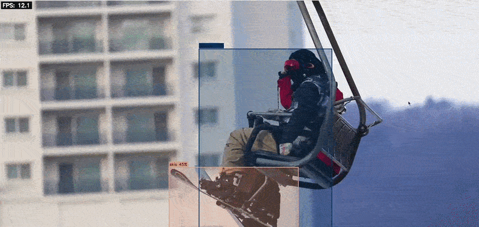
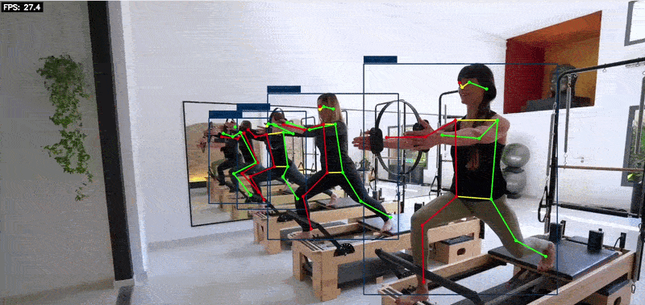
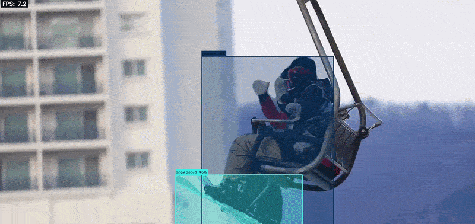
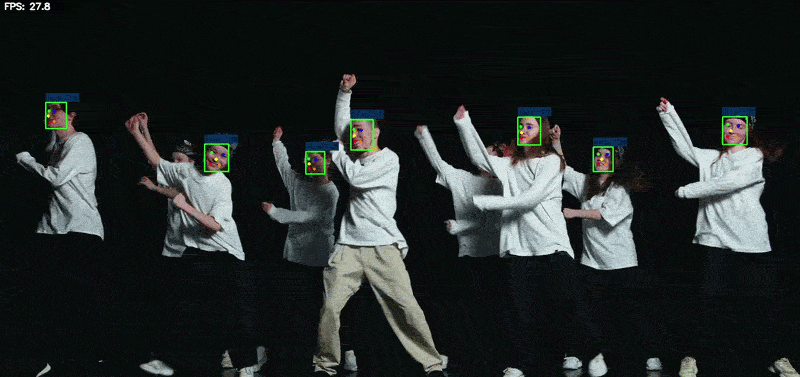
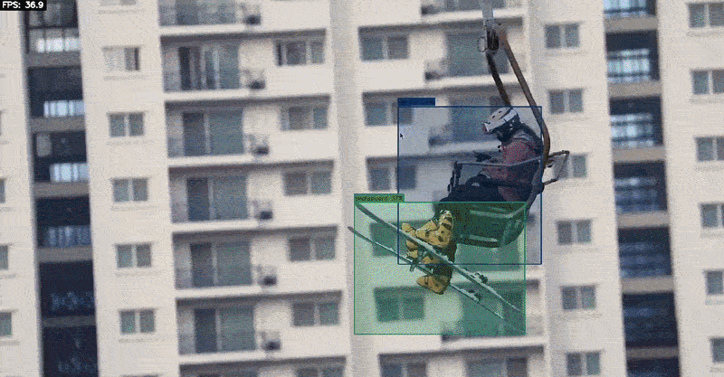
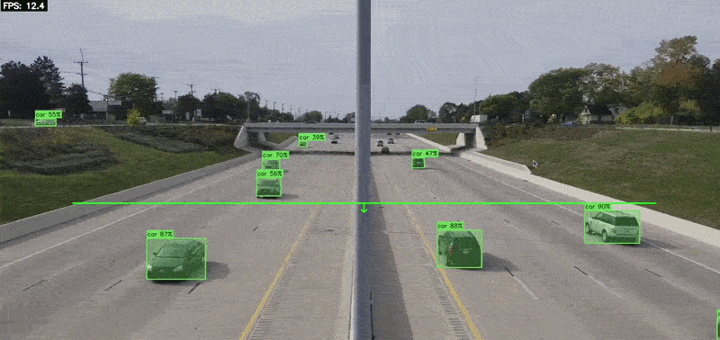
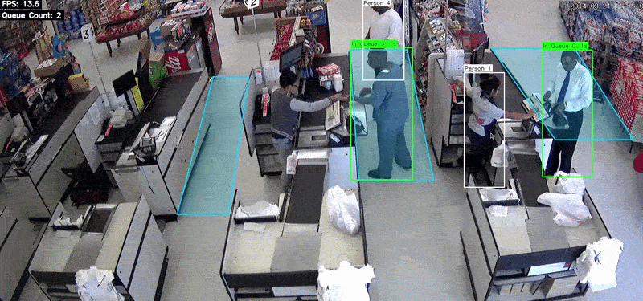

# DEEPX — Raspberry Pi 5 Examples

Compact, practical AI inference examples for the Raspberry Pi 5 using the DEEPX NPU. Examples range from object detection and pose estimation to instance segmentation and image denoising — designed to get you running on edge AI quickly.

**Quick links**
- [Sixfab Website](https://sixfab.com) | [Sixfab Docs](https://docs.sixfab.com)
- [DEEPX Website](https://deepx.ai)
- Runtime & tools: [sixfab-dx](https://github.com/sixfab/sixfab_dx) [dx_rt](https://github.com/DEEPX-AI/dx_rt)
- Driver: [dx_rt_npu_linux_driver](https://github.com/DEEPX-AI/dx_rt_npu_linux_driver)
- Full toolchain: [dx-all-suite](https://github.com/DEEPX-AI/dx-all-suite)

---

## Repository Layout

```
deepx-rpi5-examples/
├── auto-install.sh           # One-shot setup: resources, Python deps, C++ build
├── python_examples/          # Full Python demo collection (28 demos, TUI launcher)
├── cpp_examples/             # Full C++ demo collection (26 demos, TUI launcher)
├── community_projects/       # Community contributions and templates
└── docs/                     # Guides for installation and usage
```

---

## Getting Started

### Prerequisites

Install the DEEPX runtime first via the Sixfab APT repository:

### Install the apt-repo-sixfab package

```bash
wget https://github.com/sixfab/sixfab_dx/releases/download/v0.1/apt-repo-sixfab.deb
sudo dpkg -i apt-repo-sixfab.deb
```

### Install sixfab-dx package

The sixfab-dx package automatically installs the DEEPX runtime on the system.

```bash
sudo apt update && sudo apt install sixfab-dx
```
### Enable PCIe Gen 3 for optimal performance

To get the best inference throughput from the DX-M1 NPU, open the boot configuration file:

```bash
sudo nano /boot/firmware/config.txt
```

Add the following lines at the end of the file:

```bash
dtparam=pciex1
dtparam=pciex1_gen=3
```

Save and exit (Ctrl+X, then Y, then Enter), then reboot:

```bash
sudo reboot
```

### Verify the NPU is recognized
```bash
dxrt-cli -s
```

See [docs/install-raspberry-pi5.md](docs/install-raspberry-pi5.md) for full hardware and software setup instructions.

### Quick Setup

Once `sixfab-dx` is installed, run the setup script to download models and build the C++ examples:

```bash
git clone https://github.com/sixfab/sixfab-dx-examples.git
cd sixfab-dx-examples
./auto-install.sh
```

`auto-install.sh` will:
1. Validate the DEEPX runtime is working
2. Download models, videos, and sample images from the GitHub release
3. Install Python dependencies into the Sixfab venv
4. Build all C++ demos

After setup, activate the environment for every new session:

```bash
source /opt/sixfab-dx/venv/bin/activate
```

> **Note:** This activates the shared Sixfab virtual environment. If you prefer to use your own isolated environment, you can create one and install the required wheels manually:
>
> ```bash
> python3 -m venv ~/my-venv
> source ~/my-venv/bin/activate
> ```
>
> Pre-built wheels for `dx_engine` and `numpy` are available under `/opt/sixfab-dx/wheels/`:
>
> ```bash
> ls /opt/sixfab-dx/wheels/
> # dx_engine-3.3.0-cp311-cp311-linux_aarch64.whl
> # dx_engine-3.3.0-cp313-cp313-linux_aarch64.whl
> # numpy-2.4.4-cp311-cp311-manylinux_2_27_aarch64.manylinux_2_28_aarch64.whl
> # numpy-2.4.4-cp313-cp313-manylinux_2_27_aarch64.manylinux_2_28_aarch64.whl
> ```
>
> Install the wheels matching your Python version (`cp311` → Python 3.11, `cp313` → Python 3.13):
>
> ```bash
> pip install /opt/sixfab-dx/wheels/numpy-2.4.4-cp311-cp311-manylinux_2_27_aarch64.manylinux_2_28_aarch64.whl
> pip install /opt/sixfab-dx/wheels/dx_engine-3.3.0-cp311-cp311-linux_aarch64.whl
> ```
>
> To check your Python version: `python3 --version`

---

## Example Collections

### Python Examples (`python_examples/`)

A full collection of 28 demos with a Rich-based TUI launcher. Covers object detection (13 YOLO variants, SCRFD, YOLOX), segmentation, classification, pose estimation, PPU-accelerated variants, and advanced analytics (zone intrusion, people tracking, traffic counting, queue analysis).

```bash
# Launch the interactive menu
bash python_examples/start.sh
```

See [docs/python-examples.md](docs/python-examples.md) for the full demo list and configuration guide.

### C++ Examples (`cpp_examples/`)

26 demos written in idiomatic C++17 using only OpenCV and the DeepX SDK — no Qt, no YAML. Same categories as the Python collection. Each demo is a single readable file.

```bash
# Launch the interactive menu
bash cpp_examples/start.sh

# Or run a binary directly
./cpp_examples/build/object_detection/yolov8_demo --source libcamera
```

See [docs/cpp-examples.md](docs/cpp-examples.md) for the demo list, build instructions, and flags.

---

## Input Sources

All demos accept the same set of input sources:

| Source | config.yml value |
|--------|-----------------|
| Raspberry Pi camera | `rpicam` |
| USB webcam | `webcam` |
| Video file | `video` |
| Single image | `image` |
| RTSP stream | `rtsp` |

---

## Demo Gallery

| | |
|:---:|:---:|
| **YOLOv8** — object detection | **YOLO Pose** — pose estimation |
|  |  |
| **YOLOv8 Instance Segmentation** | **DeepLabV3 Semantic Segmentation** |
|  |  |
| **SCRFD Face Detection** | **YOLOv5 — PPU accelerated** |
|  |  |
| **YOLOv8 — PPU accelerated** | **YOLOv8 — Async inference** |
|  |  |
| **OSNet Re-ID** | **People Tracking** |
|  |  |
| **Smart Traffic Count** | **Queue Analysis** |
|  |  |

---

## Community and Contribution

Community improvements are welcome. If you have a demo, model optimization tip, or pipeline to share, add it under `community_projects/` and update `community_projects/community_projects.md` with usage notes. See the template at `community_projects/template_example/` for the expected structure.

---

## License

This project is distributed under the **MIT License**.
